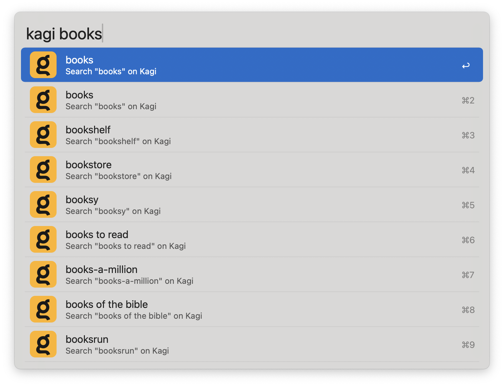

# Kagi with Search Suggestions Alfred Workflow

## Workflow Instructions

Search [Kagi](https://kagi.com), with inline search suggestions. Press <kbd>↩</kbd> to open the search results page in the default web browser.

### Session Key

Kagi normally requires you to be logged-in to search, but you also have the option of searching using a session key. This is a special token that is added to the search URL, associating it with your subscription. This allows to perform searches without logging in. This is especially useful for private browsing sessions.

To add your session Key:
1. Go to kagi.com
2. Click the hamburger menu in the upper-right corner.
3. Where it says "Session Link," click the "Copy" button.
4. You will have a URL in this format: `https://kagi.com/search?token=<key>`. Take everything after `token=` and paste it into the **Session Key** field in the Workflow Configuration.

## Building the workflow

1. Build the `kagiSearchSuggestions` Swift binary which handles getting and formatting search suggestions.
2. Notarize the binary if you want it to be portable.
3. Copy it into the `workflow` folder.